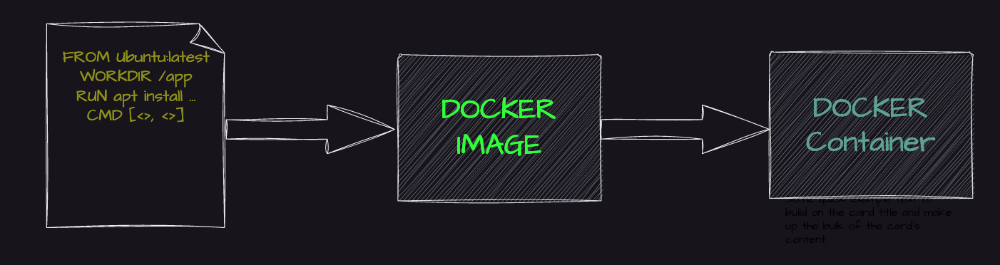

# Docker

# What is a container?
A container is a standard unit of software that packages up code and all its dependencies, so the application runs quickly and reliably from one computing environment to another. A Docker container image is a lightweight, standalone, executable package of software that includes everything needed to run an application: code, runtime, system tools, system libraries and settings.

A container is a bundle of Application, Application libraries required to run your application and the minimum system dependencies.

# Containers v/s Virtual Machine
Containers and virtual machines are both technologies used to isolate applications and their dependencies, but they have some key differences:

```
1. Resource Utilization: Containers share the host operating system kernel, making them lighter and faster than VMs. VMs have a full-fledged OS and hypervisor, making them more resource-intensive.

2. Portability: Containers are designed to be portable and can run on any system with a compatible host operating system. VMs are less portable as they need a compatible hypervisor to run.

3. Security: VMs provide a higher level of security as each VM has its own operating system and can be isolated from the host and other VMs. Containers provide less isolation, as they share the host operating system.

4. Management: Managing containers is typically easier than managing VMs, as containers are designed to be lightweight and fast-moving.
```
# Why are containers light weight?
Containers are lightweight because they use a technology called containerization, which allows them to share the host operating system's kernel and libraries, while still providing isolation for the application and its dependencies. This results in a smaller footprint compared to traditional virtual machines, as the containers do not need to include a full operating system. Additionally, Docker containers are designed to be minimal, only including what is necessary for the application to run, further reducing their size.

To provide a better picture of files and folders that container's base images have and files and folders that containers use from the host operating system (not 100 percent accurate -> varies from base image to base image). Refer below.

Files and Folders in container's base images
   ```
    /bin: contain binary executable files, such as the ls, cp, and ps commands.

    /sbin: contains system binary executable files, such as the init and shutdown commands.

    /etc: contains configuration files for various system services.

    /lib: contains library files that are used by the binary executables.

    /usr: contains user-related files and utilities, such as applications, libraries, and documentation.

    /var: contains variable data, such as log files, spool files, and temporary files.

    /root: is the home directory of the root user.
   ```
    
# Files and Folders that containers use from the host operating system
    ```
    The host's file system: Docker containers can access the host file system using bind mounts, which allow the container to read and write files in the host file system.

    Networking stack: The host's networking stack is used to provide network connectivity to the container. Docker containers can be connected to the host's network directly or through a virtual network.

    System calls: The host's kernel handles system calls from the container, which is how the container accesses the host's resources, such as CPU, memory, and I/O.

    Namespaces: Docker containers use Linux namespaces to create isolated environments for the container's processes. Namespaces provide isolation for resources such as the file system, process ID, and network.

    Control groups (cgroups): Docker containers use cgroups to limit and control the amount of resources, such as CPU, memory, and I/O, that a container can access.
    ```
It's important to note that while a container uses resources from the host operating system, it is still isolated from the host and other containers, so changes to the container do not affect the host or other containers.

**Note**: There are multiple ways to reduce your VM image size as well, but I am just talking about the default for easy comparison and understanding.

so, in a nutshell, container base images are typically smaller compared to VM images because they are designed to be minimalist and only contain the necessary components for running a specific application or service. VM's, on the other hand, emulate an entire operating system, including all its libraries, utilities, and system files, resulting in a much larger size.

I hope it is now very clear why containers are lightweight in nature.

# Docker
# What is Docker?
Docker is a containerization platform that provides an easy way to containerize your applications.
Using Docker, you can build container images, run the images to create containers and also push these containers to container registries such as DockerHub, Quay.io and so on.

In simple words, you can understand as containerization is a concept or technology and Docker Implements Containerization.

# Docker Architecture?


The above picture clearly indicates that Docker Daemon is the brain of Docker.
If Docker Daemon is killed, stops working for some reason, Docker is brain-dead :p (sarcasm intended).

# Docker LifeCycle
We can use the above Image as a reference to understanding the lifecycle of Docker.

There are three important things.

```
docker build -> builds docker images from Dockerfile
docker run -> runs container from docker images
docker push -> push the container image to public/private regestries to share the docker images.
```


# Understanding the terminology (Inspired from Docker Docs)
# Docker daemon
The Docker daemon (dockerd) listens for Docker API requests and manages Docker objects such as images, containers, networks, and volumes. A daemon can also communicate with other daemons to manage Docker services.

# Docker client
The Docker client (docker) is the primary way that many Docker users interact with Docker. When you use commands such as docker run, the client sends these commands to dockerd, which carries them out. The docker command uses the Docker API. The Docker client can communicate with more than one daemon.

# Docker Desktop
Docker Desktop is an easy-to-install application for your Mac, Windows or Linux environment that enables you to build and share containerized applications and microservices. Docker Desktop includes the Docker daemon (dockerd), the Docker client (docker), Docker Compose, Docker Content Trust, Kubernetes, and Credential Helper. For more information, see Docker Desktop.

# Docker registries
A Docker registry stores Docker images. Docker Hub is a public registry that anyone can use, and Docker is configured to look for images on Docker Hub by default. You can even run your own private registry.

When you use the docker pull or docker run commands, the required images are pulled from your configured registry. When you use the docker push command, your image is pushed to your configured registry. Docker objects

When you use Docker, you are creating and using images, containers, networks, volumes, plugins, and other objects. This section is a brief overview of some of those objects.

# Dockerfile
Dockerfile is a file where you provide the steps to build your Docker Image.

# Images
An image is a read-only template with instructions for creating a Docker container. Often, an image is based on another image, with some additional customization. For example, you may build an image which is based on the ubuntu image, but installs the Apache web server and your application, as well as the configuration details needed to make your application run.

You might create your own images, or you might only use those created by others and published in a registry. To build your own image, you create a Dockerfile with a simple syntax for defining the steps needed to create the image and run it. Each instruction in a Dockerfile creates a layer in the image. When you change the Dockerfile and rebuild the image, only those layers which have changed are rebuilt. This is part of what makes images so lightweight, small, and fast, when compared to other virtualization technologies.

# INSTALL DOCKER
A very detailed instructions to install Docker are provided in the below link

https://docs.docker.com/get-docker/

For Demo,

You can create an Ubuntu EC2 Instance on AWS and run the below commands to install docker.

```
sudo apt update
sudo apt install docker.io -y
Start Docker and Grant Access
```
A very common mistake that many beginners do is after they install docker using the sudo access.
They miss the step to Start the Docker daemon and grant access to the user they want to use to interact with docker and run docker commands.

Always ensure the docker daemon is up and running.

An easy way to verify your Docker installation is by running the below command

# docker run hello-world
If the output says:
```
docker: Got permission denied while trying to connect to the Docker daemon socket at unix:///var/run/docker.sock: Post "http://%2Fvar%2Frun%2Fdocker.sock/v1.24/containers/create": dial unix /var/run/docker.sock: connect: permission denied.
See 'docker run --help'.
```
This can mean two things.

Docker daemon is not running.
Your user does not have access to run docker commands.
Start Docker daemon
You use the below command to verify if the docker daemon is actually started and Active

```sudo systemctl status docker```

If you notice that the docker daemon is not running, you can start the daemon using the below command

```sudo systemctl start docker```

Grant Access to your user to run docker commands
To grant access to your user to run the docker command, you should add the user to the Docker Linux group. Docker group is created by default when docker is installed.

```sudo usermod -aG docker ubuntu```

In the above command ubuntu is the name of the user, you can change the username appropriately.

**NOTE:** You need to log out and login back for the changes to be reflected.

**Docker is Installed, up and running 🥳🥳**

Use the same command again to verify that docker is up and running.
```
docker run hello-world
```

Output should look like:

```
....
....
Hello from Docker!
This message shows that your installation appears to be working correctly.
...
...
```

Great Job, Now start with the examples folder to write your first Dockerfile and move to the next examples. Happy Learning :)
Clone this repository and move to example folder
```
git clone https://github.com/iam-veeramalla/Docker-Zero-to-Hero
cd  examples
```

Login to Docker [Create an account with https://hub.docker.com/]
```
docker login
Login with your Docker ID to push and pull images from Docker Hub. If you don't have a Docker ID, head over to https://hub.docker.com to create one.
Username: abhishekf5
Password:
WARNING! Your password will be stored unencrypted in /home/ubuntu/.docker/config.json.
Configure a credential helper to remove this warning. See
https://docs.docker.com/engine/reference/commandline/login/#credentials-store

Login Succeeded
```
Build your first Docker Image
You need to change the username accordingly in the below command
```
docker build -t abhishekf5/my-first-docker-image:latest .
```
Output of the above command

    Sending build context to Docker daemon  992.8kB
    Step 1/6 : FROM ubuntu:latest
    latest: Pulling from library/ubuntu
    677076032cca: Pull complete
    Digest: sha256:9a0bdde4188b896a372804be2384015e90e3f84906b750c1a53539b585fbbe7f
    Status: Downloaded newer image for ubuntu:latest
     ---> 58db3edaf2be
    Step 2/6 : WORKDIR /app
     ---> Running in 630f5e4db7d3
    Removing intermediate container 630f5e4db7d3
     ---> 6b1d9f654263
    Step 3/6 : COPY . /app
     ---> 984edffabc23
    Step 4/6 : RUN apt-get update && apt-get install -y python3 python3-pip
     ---> Running in a558acdc9b03
    Step 5/6 : ENV NAME World
     ---> Running in 733207001f2e
    Removing intermediate container 733207001f2e
     ---> 94128cf6be21
    Step 6/6 : CMD ["python3", "app.py"]
     ---> Running in 5d60ad3a59ff
    Removing intermediate container 5d60ad3a59ff
     ---> 960d37536dcd
    Successfully built 960d37536dcd
    Successfully tagged abhishekf5/my-first-docker-image:latest

Verify Docker Image is created

```docker images```

Output
```
REPOSITORY                         TAG       IMAGE ID       CREATED          SIZE
abhishekf5/my-first-docker-image   latest    960d37536dcd   26 seconds ago   467MB
ubuntu                             latest    58db3edaf2be   13 days ago      77.8MB
hello-world                        latest    feb5d9fea6a5   16 months ago    13.3kB
```

Run your First Docker Container

```docker run -it abhishekf5/my-first-docker-image```

Output
```
Hello World
```
Push the Image to DockerHub and share it with the world

```docker push abhishekf5/my-first-docker-image```

Output
```
Using default tag: latest
The push refers to repository [docker.io/abhishekf5/my-first-docker-image]
896818320e80: Pushed
b8088c305a52: Pushed
69dd4ccec1a0: Pushed
c5ff2d88f679: Mounted from library/ubuntu
latest: digest: sha256:6e49841ad9e720a7baedcd41f9b666fcd7b583151d0763fe78101bb8221b1d88 size: 1157
```

## Docker Commands

# Docker Commands

Some of the most commonly used docker commands are 

### docker images

Lists docker images on the host machine.

### docker build

Builds image from Dockerfile.

### docker run

Run a Docker container. 

There are many arguments that you can pass to this command, for example.

`docker run -d` -> Run container in a background and print container ID
`docker run -p` -> Port mapping

use `docker run --help` to look into more arguments.

### docker ps

Lists running containers on the host machine.

### docker stop

Stop running container.

### docker start

Start a stopped container.

### docker rm

Removes a stopped container.

### docker rmi

Removes an image from the host machine.

### docker pull

Download an image from the configured registry.

### docker push

Uploads an image to the configured registry.

### docker exec

Run a command in a running container.

### docker network

Manage Docker networks such as creating and removing networks, and connecting containers to networks.

# Docker Networking

Networking allows containers to communicate with each other and with the host system. Containers run isolated from the host system
and need a way to communicate with each other and with the host system.

By default, Docker provides two network drivers for you, the bridge and the overlay drivers. 

```
docker network ls
```

```
NETWORK ID          NAME                DRIVER
xxxxxxxxxxxx        none                null
xxxxxxxxxxxx        host                host
xxxxxxxxxxxx        bridge              bridge
```


### Bridge Networking

The default network mode in Docker. It creates a private network between the host and containers, allowing
containers to communicate with each other and with the host system.


If you want to secure your containers and isolate them from the default bridge network, you can also create your own bridge network.

```
docker network create -d bridge my_bridge
```

Now, if you list the docker networks, you will see a new network.

```
docker network ls

NETWORK ID          NAME                DRIVER
xxxxxxxxxxxx        bridge              bridge
xxxxxxxxxxxx        my_bridge           bridge
xxxxxxxxxxxx        none                null
xxxxxxxxxxxx        host                host
```

This new network can be attached to the containers when you run these containers.

```
docker run -d --net=my_bridge --name db training/postgres
```

This way, you can run multiple containers on a single host platform where one container is attached to the default network, and 
the other is attached to my_bridge network.

These containers are completely isolated with their private networks and cannot talk to each other.


However, you can at any point of time, attach the first container to my_bridge network and enable communication

```
docker network connect my_bridge web
```


### Host Networking

This mode allows containers to share the host system's network stack, providing direct access to the host system's network.

To attach a host network to a Docker container, you can use the --network="host" option when running a docker run command. When you use this option, the container has access to the host's network stack, and shares the host's network namespace. This means that the container will use the same IP address and network configuration as the host.

Here's an example of how to run a Docker container with the host network:

```
docker run --network="host" <image_name> <command>
```

Keep in mind that when you use the host network, the container is less isolated from the host system, and has access to all the host's network resources. This can be a security risk, so use the host network with caution.

Additionally, not all Docker image and command combinations are compatible with the host network.
So it's important to check the image documentation or run the image with --network="bridge"
option (the default network mode) first to see if there are any compatibility issues.

### Overlay Networking

This mode enables communication between containers across multiple Docker host machines, allowing containers to be connected to a single network even when they are running on different hosts.

### Macvlan Networking

This mode allows a container to appear on the network as a physical host rather than as a container.

# Docker Volumes

## Problem Statement

It is a very common requirement to persist the data in a Docker container beyond the lifetime of the container. However, the file system
of a Docker container is deleted/removed when the container dies. 

## Solution

There are two different ways how docker solves this problem.

1. Volumes
2. Bind Directory on a host as a Mount

### Volumes 

Volumes aims to solve the same problem by providing a way to store data on the host file system, separate from the container's file system, 
so that the data can persist even if the container is deleted and recreated.


Volumes can be created and managed to use the docker volume command. You can create a new volume using the following command:

```
docker volume create <volume_name>
```

Once a volume is created, you can mount it to a container using the -v or --mount option when running a docker run command. 

For example:

```
docker run -it -v <volume_name>:/data <image_name> /bin/bash
```

This command will mount the volume <volume_name> to the /data directory in the container. Any data written to the /data directory
inside the container will be persisted in the volume on the host file system.

### Bind Directory on a host as a Mount

Bind mounts also aim to solve the same problem but in a complete different way.

Using this way, user can mount a directory from the host file system into a container. Bind mounts have the same behavior as volumes, but
are specified using a host path instead of a volume name. 

For example, 

```
docker run -it -v <host_path>:<container_path> <image_name> /bin/bash
```

## Key Differences between Volumes and Bind Directory on a host as a Mount

Volumes are managed, created, mounted and deleted using the Docker API. However, Volumes are more flexible than bind mounts, as 
they can be managed and backed up separately from the host file system, and can be moved between containers and hosts.

In a nutshell, Bind Directory on a host as a Mount is appropriate for simple use cases where you need to mount a directory from the host file system into
a container.
While volumes are better suited for more complex use cases where you need more control over the data being persisted
in the container.

## Multi-container Application

We can run multi-container applications by simple executing the command `docker compose up -d`.
"-d" tells the daemon to run in detached mode.

We can stop and delete the containers in the multi-container application using `docker compose down`

When developing with docker,
we may need to automatically update and preview our running services as we edit and save our code.
We can use `docker compose watch` for this.

## Docker Development mode

To run the container in development mode. We need to bind the volume from the host to the container using the **Volumes**.

The below code snippet to the compose.yaml.
The docker runs in development mode and rebuilds when ever it detects changes in the source code in the host machine.
```yaml
    volumes:
      - .:/code
    environment:
      FLASK_DEBUG: "true"  
```

## Interview Questions

# What is Docker?

Docker is an open source containerization platform.
It enables developers to package applications and their dependencies into containers.

# How are Containers different from virtual Machines?

* Virtual Machines consist of its own operating system which is too heavy on the top of hypervisor. 
* Whereas the Docker Containers consist only the application files, dependencies, and small set of system library files.
* Docker uses the Host Operating system for most of the operations.

Containers and virtual machines are both technologies used to isolate applications and their dependencies,
but they have some key differences:

```
1. Resource Utilization: Containers share the host operating system kernel, making them lighter and faster than VMs. VMs have a full-fledged OS and hypervisor, making them more resource-intensive.

2. Portability: Containers are designed to be portable and can run on any system with a compatible host operating system. VMs are less portable as they need a compatible hypervisor to run.

3. Security: VMs provide a higher level of security as each VM has its own operating system and can be isolated from the host and other VMs. Containers provide less isolation, as they share the host operating system.

4. Management: Managing containers is typically easier than managing VMs, as containers are designed to be lightweight and fast-moving.
```

# What is Docker Life Cycle?

* Developers write the Docker file with a set of commands that defines base image and required dependencies to run the application.
* Now using the build command, the developer builds the image using the Docker file.
* Then using the run command and with required arguments image is converted into the container.
* Finally, the container is pushed into the registry using the push command.

# What are the Docker components?

**Docker Client**: The Docker CLI where we can run or provide the inputs in the form of Docker commands.
**Docker Host**: A remote system that contains the Docker Daemon,
which creates the Containers and images based on the user inputs.
**Docker Daemon**: Heart of the Docker which performs the actions based on the user commands.

# What is the difference between COPY and ADD?

Docker ADD can copy files from a URL unlike the Docker COPY can only copy files from the host system into the containers.

For example, if we need to copy the files from s3 location or GitHub repo, we need to use the docker **ADD** command.

# What is the difference between CMD and ENTRYPOINT?

We can override the commands in the CMD by the arguments passed in the CLI,
whereas we cannot override the ENTRYPOINT commands.

# What are the different types of networking in Docker and what is the default?

The default networking in Docker is Bridge.

**Types:**
* **Bridge:** It creates a virtual ethernet connection or Docker0 network to communicate between the container and host system.
* **Overlay:** Using this network, we can connect multiple containers with multiple hosts.
* **Host:** This mode allows containers to share the host system's network stack, providing direct access to the host system's network.
* **MacVlan:** This allows the container to act as a physical host network.

# Can you explain how to isolate networking between the containers?

We can create our own bridge networking to isolate the container from other containers.

# What is a multi-stage build in Docker?

Multi-stage build allows us
to build the docker container in multiple stages allowing to copy artifacts from one stage to the other.
The major advantage of this build is to build lightweight containers.

# What are distroless images in docker?

Distroless images contain only application and its dependencies with a very minimum operating system libraries.
They do not contain package managers,
shells or any other programs you would expect to find in a standard Linux distribution.
They are very small and lightweight images.

# Real time challenges with Docker?

- Docker is a single daemon process. Which can cause a single point of failure if the Docker daemon goes down for some reason. **Alternatives** Podman and Buildah.
- Docker daemon runs as a root user. Which is a security threat. Any process running as a root can have adverse effects. When it is comprised for security reasons, it can impact other applications or containers on the host.
- Resource Constraints: If we are running too many containers on a single host, we may experience issues with resource constraints. This can result in slow performance or crashes.

# What steps should we take to secure containers?

* Use distroless or images with not too many packages as our final image in a multi-stage build, so there is less chance of security issues.
* Ensure that the networking is configured properly. This is one of the most common reasons for security issues. If required, configure custom bridge networks and assign them to isolate containers.
* Use utilities like **Sync** to scan our container images.