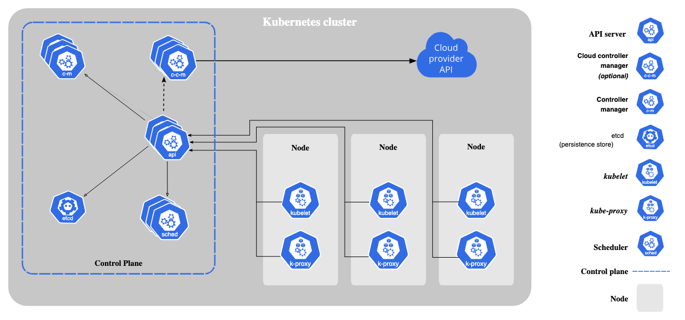

# Kubernetes

It is a container orchestration tool to help in managing and deploying containers on multiple servers.

# Docker V/S Kubernetes

Docker helps in building images, converting images into containers and storing them in the registry.
We can even pull images from the registry using docker pull command.

Whereas kubernetes is a container orchestration tool solves the below-mentioned docker problems.

# **Docker Problems**
## Problem 1: Short life (Single Host)
* Docker containers are **Ephemeral** in nature. Which means the containers are short life, die and revive anytime.
* Assume a hundred containers are running on a single host and one container is consuming more memory than another container may lack of the memory and dies or cant start the container.
* So the users cannot access the application in that container.

## Problem 2: Auto Healing

* Once the containers are down, they cannot start on their own without the users interfering.

## Problem 3: Auto scaling

* Containers cannot be scaled on their own using docker.

# How it solves?

## Problem 1:
* Kubernetes is a cluster i.e., group of nodes.
* When one container is using more memory, and another container is not performing well or cant able to start. Kubernetes will transfer that container into another pod or node.

## Problem 2:

* Kubernetes controls or fixes the damage.
* Kubernetes has an auto-healing feature which starts a new container when the container is going down using API server.

## Problem 3:

* Kubernetes inbuilt consists of Replication Controller or **Horizontal Pod Autoscaller(HPA)**, which helps to increase the count of nodes by replicating. 
  We can automatically scale by setting the threshold value in the yaml file using HPA.

# Kubernetes cluster
It is a collection on multiple servers or machines
that consists of one master/control machine and multiple worker machines.

# Components of Kubernetes Cluster


* **Control Plane:** The control plane components make global decisions about the cluster like scheduling, 
  as well as detecting and responding to cluster events like starting up a new pod when a deployment's replicas field is unsatisfied.
* The control plane consists of multiple individual components. These can be run anywhere, and we can run multiple instances of each component for high availability.

  * **kube-apiserver:** 
    * The API server is a component of the kubernetes control plane that exposes the kubernetes API. 
    * The API server is the front end for the kubernetes control plane.
    * The main implementation of the kubernetes API server is kube-apiserver. kube-apiserver is designed to scale horizontally, it scales by deploying more instances.
    * We can run several instances of kube-apiserver and balance traffic between those instances.

  * **etcd:**
    * Consistent and highly-available key value store used as kubernetes backing store for all the cluster data.
    * If you use etcd as a cluster backing store, make sure you have a backup plan for the data.

  * **kube-scheduler:**
    * It watches for the newly created Pods with no assigned node, and selects a node for them to run on.
  
  * **kube-controller-manager:**
    * It runs controller processes. Controllers are control loops that watch the state of our cluster, then make or request changes
      needed to reach the desired state.
      * **Control via API Server:**
        * The **job** controller is an example of a kubernetes built-in controller. Built-in controllers manage state by interacting with the cluster API server.
        * Job is a kubernetes resource that runs a pod, or several pods to carry out a task and then stop.
        * When the job controller sees a new task, it makes sure that, somewhere in your cluster, the kubelets on a set of Nodes are running the right number of Pods to get the work done.
        * The job controller does not run any pods or containers itself. It tells the API server to create or remove Pods.

      * **Direct Control:**
        * In contrast with the job, some controllers need to make changes to things outside our cluster.
  
  * **cloud-controller-manger:**
    * The CCM links our cluster into our cloud provider's API, and separates out the components that interact with the 
      cloud platform from the components that interact only with the cluster.
    * The CCM only runs controllers that are specific to our cloud provider. If we are running our cluster in on-premises or
      in learning-env in own PC, the cluster does not have a cloud controller.
    * As with the kube-controller-manager, the cloud-controller-manager combines several logically independent control loops into a 
      single binary that you run as a single process.
    * The following controllers can have cloud provider dependencies:
      * Node Controller: For checking the cloud providers to determine if a node has been deleted in the cloud after it stops responding.
      * Route Controller: For setting up routes in the underlying cloud infrastructure.
      * Service Controller: For creating, updating and deleting cloud provider load balancers.

* **Node Components:**
  * Node components run on every node maintaining running pods and providing kubernetes running environment.
  * **kubelet:**
    * It runs on every node in the cluster and makes sure that containers described in the podspec are running and healthy.
    * Kubelet doesn't manage containers which are not created by the kubernetes.
  * **kube-proxy:**
    * It is a network proxy runs on every node in the cluster maintaining network rules on nodes. These network rules allow
      network communication to your pods from network sessions inside or outside of the cluster.
  * **Container Runtime:**
    * It empowers the kubernetes to run containers effectively. It is responsible for managing the execution and lifecycle of containers within the kubernetes environment.
      
## Building a kubernetes cluster

# What is kubeadm?

**Kubeadm** is a tool that will simplify the process of setting up kubernetes cluster.

# What is kubectl?
**Kubectl** is a command-line tool used to deploy and manage applications on Kubernetes clusters. 
It allows you to run commands against Kubernetes clusters and provides information about the state of cluster resources.

* **Step-1:** Create three servers with Ubuntu distribution and the size of medium.
  * One master server and two worker servers.
* **Step-2:** Login to the master server and two worker servers.
  * Set the hostnames to all three servers using the command 
    ```
     sudo hostnamectl set-hostname {host_name}
    ```
* **step-3:** Login to the three servers and update the host file in the **/etc** folder to allow the network to communicate among them.
  * Edit the /etc/hosts file using the command 
  ```
  sudo vi /etc/hosts
  ```
  * Add the hosts
  ```
  {private_ip_address} {control_server_hostname}
  {private_ip_address} {worker_server_1_hostname}
  {private_ip_address} {worker_server_2_hostname}
  ```
  * Logout and Login back to see the changes in the hostname.

* **Step-4:** Enabling kernel modules and modifying some system settings.
  ```
  cat <<EOF | sudo tee /etc/modules-load.d/k8s.conf
  overlay
  br_netfilter
  EOF
  ```
* **Step-5:** The modules will be enabled automatically when the server starts but to enable the modules without 
  restarting the servers run the below command.
  ```
  sudo modprobe overlay
  sudo modprobe br_netfilter
  ```
* **Step-6:** Setup system level configurations for networking.
  ```
  cat <<EOF | sudo tee /etc/sysctl.d/k8s.conf
  net.bridge.bridge-nf-call-iptables  = 1
  net.bridge.bridge-nf-call-ip6tables = 1
  net.ipv4.ip_forward                 = 1
  EOF
  ```
* **Step-7:** Apply sysctl params without rebooting the services.
  ```
  sudo sysctl --system
  ```
* **Step-8:** Install containerd package on the master service
  ```
  sudo apt-get update && sudo apt-get install containerd
  ```
* **Step-9:** Configure containerd files. Create a folder in the etc folder with name containerd
  ```
  sudo mkdir -p /etc/containerd
  sudo containerd config default | sudo tee /etc/containerd/cofig.toml
  ```
* **Step-10:** Restart the containerd configuration to make sure that the system is using the updated containerd config file.
  ```
  sudo systemctl restart containerd
  ```
* **Step-11:** To install kubernetes packages, we need to disable swap
  * Swap is a type of virtual memory that can be used when the physical memory (RAM) is full. 
    It allows the system to temporarily move inactive data from RAM to the hard drive,
    freeing up memory for other processes.
    In Kubernetes,
    swap is turned off by default
    because it can negatively impact the performance of pods and make it difficult to predict
    how a pod might use memory.
    This is because the MMU,
    which manages the memory in a system,
    may not always be able to determine the best time to move data between RAM and swap space
    ```
    sudo swapoff -a
    ```
* **Step-12:** We need to install the packages **apt-transport-https and curl** before installing the kubernetes.
  ```
  sudo apt-get update && sudo apt-get install -y apt-transport-https curl
  ```
* **Step-13:** Create a directory under /etc/apt/ name it as keyrings and install the official .gpg file and add it using apt-key
  ```
  sudo mkdir -p /etc/apt/keyrings
  echo "deb [signed-by=/etc/apt/keyrings/kubernetes-apt-keyring.gpg] https://pkgs.k8s.io/core:/stable:/v1.28/deb/ /" | sudo tee /etc/apt/sources.list.d/kubernetes.list
  curl -fsSL https://pkgs.k8s.io/core:/stable:/v1.28/deb/Release.key | sudo gpg --dearmor -o /etc/apt/keyrings/kubernetes-apt-keyring.gpg
  sudo apt-get update
  ```
* **Step-15:** Install kubernetes tool and set them on hold not to update automatically.
  ```
  sudo apt-get install -y kubelet kubeadm kubectl
  sudo apt-mark hold kubelet kubeadm kubectl
  ```
# Initialize the cluster
* Run the following command in the master node to initialize the cluster
  ```
  sudo kubeadm init --pod-network-cidr {ip-address/16} --kubernetes-version {version}
  ```
* To start using your cluster, you need to run the following as a regular user:
  ```
  mkdir -p $HOME/.kube
  sudo cp -i /etc/kubernetes/admin.conf $HOME/.kube/config
  sudo chown $(id -u):$(id -g) $HOME/.kube/config
  ```
* Check whether the cluster initialization is success or not by running the command:
  ```
  kubectl get nodes
  ```
* To add the network configuration, run the following command
  ```
  kubectl apply -f https://raw.githubusercontent.com/projectcalico/calico/v3.25.0/manifests/calico.yaml
  ```
* Now we need to join worker nodes to the cluster. Run the below command in the master node to get the join command.
  ```
  kubeadm token create --print-join-command
  ```
* Run the output generated by the above command as root user in the worker servers to join them to the cluster.