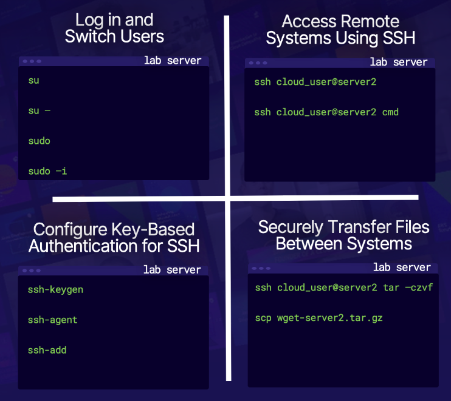
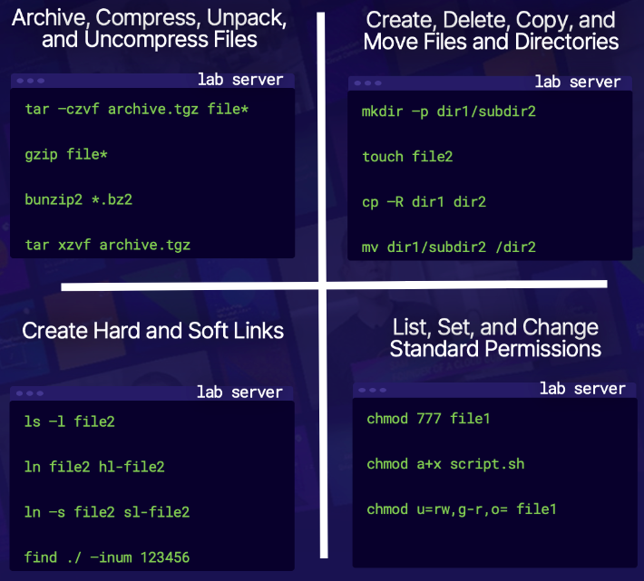
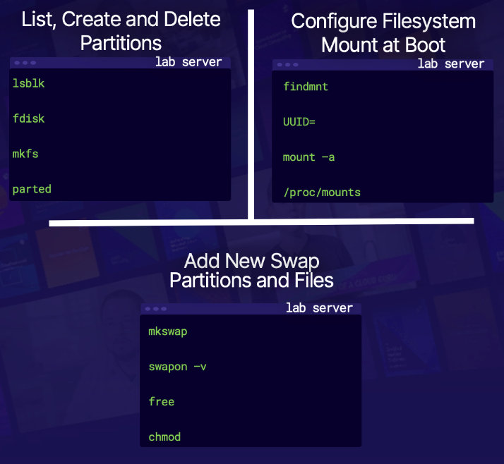
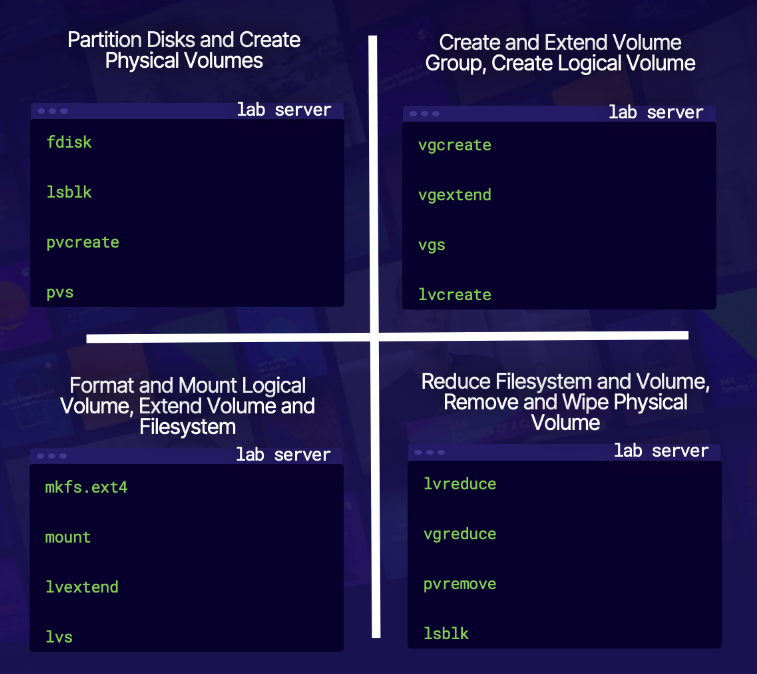

# Linux Certified System Administrator Exam (EX200)

# Accessing Linux Systems


```
## Scenario-1:
* We have a few open tickets for our new RHEL 8 server. We will check the server to see if any outstanding patches need 
  to be applied, grab some web content for the web_user account, and help the db_user account retrieve database dumps 
  from another server.
  We only have our cloud_user login and password to access the server.

**Method-1: Console Login—** The old-school way to access a system, local logins.
**Method-2: su command** Allows a user to become another user.
**Method-3: sudo command** Allows a user to become another user, and execute commands as root.
**Method-4: SSH commands** The SSH suite of commands allows securing remote logins, remote command execution, connection
                            tunneling, and file transfers.
```

* After generating the ssh-key using **ssh-keygen**.
  We can copy the key and add it to log in to another server using the
  command **ssh-copy-id user_name@server_addr**
* Now we can log in using **ssh user_name@server_addr**
* When we just need the information from another server, we can directly run the command using the SSH and get the 
  output.
  **ssh user_name@server_addr cat path\to\file**
* We can change the password of the user **sudo -i passwd {user_name}**
* We can execute the command as root user from another user **sudo -i -c "echo $PATH"

```
login to first server: ssh cloud_user@public_ip and enter the password
create the ssh-key: ssh-keygen
Enter a passphrase: give a passphrase that you can remember.
copy the ssh_id to the second server: ssh-copy-id {public_ip_address_of_second_server}
Enter the password
Connect to the second server: ssh cloud_user@{public_ip} and enter the password
Test the passphrase created above
Exit from the server
Add the ssh-key in the first server
ssh-add
Login to the second server: ssh cloud_user@public_ip
Now we don't need to enter the password to login to the second server.
```
# SCP
* When we need to copy files from the remote server to the local system, we can use the 
  **scp user_name@server_addr:path/to/the/files path/to/loc/to/save/in/local**
  when we know the location of the files we need to copy.
# SFTP
* When we don't know the exact path of the files in the remote server, we have to use the **sftp** to securely log in
  to remote server and look around.
  **sftp user_name@web_add**
* Once we get the location of required files using sftp, we can get them to the local system using **mget path/to/the/file**

```
## Scenario-2:
Our web developers need Apache installed on their RHEL 8 server.
Additional to the web server software, our web developers would like us to confirm that the documentation is installed 
and send them a copy of the Apache license file.

* we can check the manual  pages using man command
* we can check the info pages using info command
* we can check the user documentation of the command under the /usr/share/doc folder
* man httpd; info httpd; ls -la /usr/share/doc | egrep -i (case independent) "httpd | mariadb| mysql"
```
# I/O logs

* We can send the standard errors to the log file using the **2>**. Here 2 represents the standard errors.
* The following command sends the standard output to the master.log file and standard errors to the errors.log file
  `sudo grep httpd /var/log/* > raw_logs/master.log 2> errors.log`.
  This command is looking for the logs referencing httpd in the /var/log folder.
* We can even send the errors to the null to avoid them to appear on the screen, and also we don't need it for 
  further processes by providing /dev/null as the destination to the errors.
  **2> /dev/null**
* **2>&1** this will send the stderr to the stdinput and log's them.
* **journalctl** queries the journal and provide the output based on the specifications given.
  `journalctl --unit=httpd --no-pager >> raw_logs/master.log`. This command appends the httpd unit logs to the master.log file.

* We can exclude content using the **grep command with -v**. The following command excludes the logs with dnf or secure
  or both. `grep -v "dnf|secure" /raw_logs/master.log > httpd_logs/no_dnf_secure.log`

# Vi editor

```
Senario:
We've been asked to document the /etc/hosts files on our servers.
Our manager has asked us to create a spreadsheet documenting the contents of our /etc/hosts files on our RHEL 8 servers.
We're going to edit a copy of the /etc/hosts file on one server, converting the contents to a comma-seperated file
that we can import to our spreadsheet.
```
* we can copy the /etc/hosts using cp command and edit the file manually by replacing the spaces with commas and adding
  column names on line 1.
* The other way to do that is using **awk** command. The following command separates the content in the host's file by space
  and prints the first column second column and third column along with the comma in between them and write the output 
  to the hosts.csv file in the current working directory.
  `awk -F ' ' {print $1 "," $2 "," $3 "," $4} /etc/hosts > ./hosts.csv`
* We can input the content to the file using the **cat > input.txt**.
  Type the input data.
  When you want to exit from the editor, press **ctrl+d**.

```
Senario:
The web team needs a new content location setup.
The web team has a project that needs new a shared storage location set up.
The location needs to be owned by the web_team group with specific permissions.
In addition, they will be migrating some existing content to the location, so we need to set up some links for legacy content support.
Finally, they;ve asked us to configure the web_user account so that new files can't be accessed by the other users on the system.
```
* We can create a user or group using the **useradd or groupadd** command
* To add the user to the group **usermod -a (append) -G (for Group) {group name} {username}**
* To remove the user from the group **gpasswd -d (delete) {username} {group name} **
* To delete a user **userdel {username}**
* To delete a group **groupdel {group name}**
* To add the files or folders to owners or groups **chown -R (recursively) web_user: web_group path/to/folder**
**Soft-link for folders and Hard-link for files**
* To create a soft link **ln -s {location of the folder} {new location}**. We cannot create hardlinks to the folder. 
* The files in the source folder will replicate automatically into the destination folder when soft-link is used.
* If we delete the original file in soft-link, the linked file will also get deleted.
* Hardlink will create a completely new file in destination location.
* We can set the umask to the user by **echo 'umask 0027' > ~/.bashrc**

## Archiving / Compressing

* Archiving is the process of collecting one or more files or folders and storing in a single file. [tar and star]
* Compression is reducing the size of the file. [gzip and bzip2]
* We can use the archiving and compression together or separately.

```
Scenario:
The /home directory on our RHEL 8 server is filling up, and we need to do some housekeeping. We have inactive user accounts,
remnants off projects, and other items that need attending to reduce our space utilization and make things more organized.
```
* To archive the folder/file using tar `tar -cvf (create verbose folder) {folder_name} {new_archive_name}.tar`
* To extract the archived folder/file using tar `tar -xvf (extract verbose file_name) {file_name}.tar`
* We can compress the archived file ` tar -cvfz (create verbose file zip_compress) {file_names} {archived_file}.tar.gz`
* We can extract the compressed archived file `tar -xvfz (extract verbose file_name unzip) {file_name}.tar.gz`
* We can compress using gzip `gzip {file}`
* We can decompress using gzip `gzip -d {file}.gz`

## Shell scripting

```
Scenario:

When the web-admins wants to check the packages installed or available or need to update. They can perform these tasks
just by pasing arguments to the below bash script.
```
```Bash
#!/bin/bash

# Script to allow web-admins to perform some yum checks
# Usage: ./example1.sh <action> <package>
# check-update: No package required
# check-installed: Specify the required package name
# check-available: Specify the required package name

# variables
action=$1
package=$2

# package manager
yum=/usr/bin/yum

# main

if [ "$action" == "check-update" ] ; then
  $yum check-update >> web_admin.log
  yum_results=$?   # $? returns the previous commands output
        case $yum_results in
                100)
                    echo "Updates available!"
                    exit 111
                    ;;
                0)
                  echo "No updates available!"
                  exit 112
                  ;;
                1)
                  echo "Error!"
                  exit 113
                  ;;
        esac

elif [ "$action" == "check-installed" ] ; then
  $yum list --installed "$package" >> web_admin.log 2>&1  # sends all the stderr to the std input and log to the file.
  yum_results=$?
        case $yum_results in
                0)
                  echo "Package is installed!"
                  exit 114
                  ;;
                1)
                  echo "Package is not installed!"
                  exit 115
                  ;;
        esac

elif [ "$action" == "check-available" ] ; then
  $yum list --available "$package" >> web_admin.log 2>&1
  yum_results=$?
        case $yum_results in
                0)
                  echo "Package is available!"
                  exit 116
                  ;;
                1)
                  echo "Package is not available"
                  exit 117
                  ;;
        esac

else
  echo "Invalid Options. Please specify one of the following:"
  echo "check-update: No package to specify."
  echo "check-installed: Specify the package."
  echo "check-available: Specify the package."
  exit 118

fi
```

* We can grep through the different subfolders using `grep 'word1\|word2\|word3' /etc/{sf_1,sf2,sf3}`

## Managing the Boot Process

```
Scenario:
We lost the root password to our system.
We need to leverage our ability to interrupt the system boot to change the root password.
We explore the interactive nature of the GRUB bootloader and use it to access our system to perform important system
maintenance and recovery procedures.
```
* Boot process:
  * BIOS/POST: Server is powered on, BIOS loads and executes POST.
  * Master Boot Record (MBR): BIOS loads the contents of the MBR.
  * GRUB: The Grub bootloader loads the kernel.
  * Kernel: The kernel loads drivers and starts systemd
  * systemd: Reads /etc/systemd configuration files and default.target file.
  * default.target: System comes to the state as defined in the default.target

* step-1: login as a user with root permissions
* step-2: check the default target file using `systemctl get-default`
* step-3: reboot the system using `sudo systemctl reboot`
* step-4: Now we will enter into bios mode. move to the linux line and add `rd.break` at the end and exit.
* step-5: remount the /sysroot as read and write using `mount -o rw,remount /sysroot`
* step-6: change to root using `chroot /sysroot`
* step-7: change the password using `password root` and set the new password.
* step-8: Now auto-relabel the SElinux using `touch /.autorelabel`
* step-9: exit the root shell
* step-10: remount the sysroot to readonly mode using `mount -o ro, remount /sysroot` and exit the emergency mode.
* step-11: enter the bios mode again and move to the linux line and add `systemd.unit=multi-user.target` and exit
* step-12: login using root and password created early.

## Logging and using Journals

* To persist the journal files store them in the /var/log/journal folder.
* Create a folder /var/log/journal and run the command `journalctl --flush` in that folder to set it as default.

## Identifying individual processes and killing them and scheduling the processes

* Using `top` command we can look into the processes and a lot of info about the processes.
* Using `pkill` we can kill the process
* Using `chrt` we can schedule the priority level of the process.

## Managing mounted disks
 

**Persistent mounts**
* Mounts that are configured to mount automatically, such as at boot time, or when a request to mount all file systems is
  issued.
* The ensure our system is configured to survive routine processes such as reboot.
* Just add mounts to the /etc/fstab to ensure persistence.

```
Scenario:
We have some temporary mounts on the RHEL8 server that our summer intern setup that we need to make permanent.
There is a filesystem for a web project that needs to stick around a little longer and some addtional swap space that was
added and now needs to be made persistent. 
```
Get the uuid's of the mounts and add them to the /etc/fstab file
* **fdisk** using fdisk we can create partitions.`sudo fdisk /dev/xvdb` creates a partition under xvdb
* To see the partitions we can use `sudo fdisk -l or lsblk`
* To create an ext4 filesystem in the created partition `sudo mkfs.ext4 /dev/xvdb1`
* Mount the file system using `sudo mkdir /mnt/ext4disk` and `sudo mount /dev/svdb1 /mnt/ext4disk/`
* Add the uuid of the file system to the /etc/fstab file. Get the UUID using `lsblk -f`
* mount the filesystem using `sudo mount -a`
* To create a swap use the command `sudo mkswap /dev/xvdd(location of the filesystem)`
* add the uuid to the etc/fstab providing the type as swap
* mount it using sudo mount -a
* We can create moreswap using the `sudo mkswap /moreswap`
* add the UUID to the /etc/fstab to make it persistent.
* reload the daemon using `sudo systemctl deamon-reload`
* run the command `sudo swapon /moreswap` to load the moreswap as swap memory filesystem.

## Logical volumes



* list the blocks using `lsblk`
* create the partition and change the type to Linux LVM using `sudo fdisk /dev/xvdd` and enter **t** once you created the
  partition and select the id for Linux LVM and enter it. For first time to list the id catalog enter l
* Do the above task for all the required file systems.
* Run the command `sudo partprobe` to update the kernel with the work we did till now.
* To create a physical volume `sudo pvcreate /dev/xvdb1` and for the remaining.
* We can check the physical volumes using `sudo pvs`
* Create a volume group and add the xvdb1 volume to that group using `sudo vgcreate VolGrp0 /dev/xvdb1`
* To check the volume group `sudo vgs`
* We can extend the group by adding the additional physical volumes using `sudo vdextend VolGrp0 /dev/xvdc1 /dev/xvdd1`
* We can create logical volume using `sudo lvcreate -L+3.99(size) -n "datavol" (name) VolGrp0`
* Check the logical volumes using `sudo lvs`
* Create a filesystem in the datavol using `sudo mkfs.ext4 /dev/VolGrp0/datvol`
* create a mount point using `sudo mkdir -p /mnt/datavol` and `sudo mount /dev/VolGrp0/datavol /mnt/datavol`
* we can extend the logical volume using `sudo lvextend -L+1.91GB /dev/VolGrp0/datavol`
* We can resize the logical volume using `sudo lvresize --resizefs --size 5.98GB /dev/VolGrp0/datavol`
* We can reduce the size of the volume using `sudo lvreduce --resizefs --size 3.98GB /dev/VolGrp0/datavol`
* We can remove the physical volume out of the volume group using `sudo vgreduce /dev/VolGrp0 /dev/xvdd1`
* We can remove the logical volume using `sudo pvremove /dev/xvdd1`